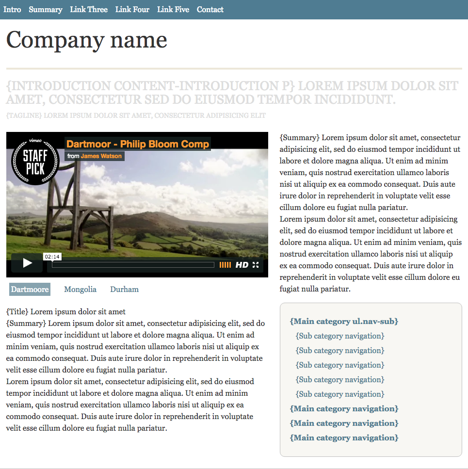

# Foundations Session 8

## Homework




## Tooling

```
$ cd <session7>
$ npm install
```

`$ npm run boom!`


Review: Media Query - Mobile First

Review: Variables

Review: Responsive Main Nav

Review: Show/Hide Nav JS

Review: Animation with CSS


## Columns for Content

Content (effects multiple regions - re-examine the DOM).

In a new _structure.scss file:

```css
.content {
	max-width: 940px;
	margin: 0 auto;
	padding-bottom: 1.5em;
}
.content-main {
 	box-sizing: border-box;
	float: left;
	width: 60%;
	padding-right: 24px;
}
.content-sub {
	float: right;
	width: 40%;
}
```

Apply the second breakpoint variable to medium screen sizes and above only:

```css
@media (min-width: $break-two) {
	.content {
		max-width: 940px;
		margin: 0 auto;
		padding-bottom: 1.5em;
	}
	.content-main {
		box-sizing: border-box;
		float: left;
		width: 60%;
		padding-right: 24px;
	}
	.content-sub {
		float: right;
		width: 40%;
	}
}
```

### Box sizing 

The universal approach (applies to all elements):

```
*, *:before, *:after {
  box-sizing: inherit;
}
html {
  box-sizing: border-box;
}
```

Check and make corrections to the nav.

The Secondary div

```css
.secondary {
	background:#f8f7f3;
	border:1px solid #bfbfbf;
	padding:1em;
}
```

### Micro clearfix

```css
.clearfix:before,
.clearfix:after {
    content: " ";
    display: table;
}
.clearfix:after {
    clear: both;
}
```

Add the clearfix to the content and secondary divs

`<div class="content clearfix">`

`<div class="container secondary clearfix">`

### Responsive Images

iFrame and images need to expand and contract to fit. 

Note the inline width and height parameters for the iFrame in the HTML.

```css
img,
iframe {
  width: 100%;
}
```

### Video Switcher - JavaScript

The old school JavaScript

```
$('.content-video a').on('click',function(){
	$('.content-video a').removeClass('active');
	$(this).addClass('active');
	var videoToPlay = $(this).attr('href');
	$('iframe').attr('src',videoToPlay);
	console.log(videoToPlay);
	return false;
 });
```

```
const videoLinks = document.querySelectorAll('.content-video a')
const videoLinksArray = [...videoLinks]
videoLinksArray.forEach( videoLink => videoLink.addEventListener('click', selectVideo ))

function selectVideo(){
	console.log(this)
	event.preventDefault()
}
```

```
function selectVideo(){
	const videoToPlay = this.getAttribute('href')
	console.log(videoToPlay)
	event.preventDefault()
}
```

Add the iFrame

```
const iFrame = document.querySelector('iframe')
const videoLinks = document.querySelectorAll('.content-video a')
const videoLinksArray = [...videoLinks]
videoLinksArray.forEach( videoLink => videoLink.addEventListener('click', selectVideo ))

function selectVideo(){
	const videoToPlay = this.getAttribute('href')
	iFrame.setAttribute('src', videoToPlay)
	console.log(iFrame)
	event.preventDefault()
}
```

Active class

Add css for the active class (for the first video iframe link):

```css
.btn-list {
	padding: 6px;
	.active { 
		background: #87a3af;
		text-shadow: none; 
		color: #fff;
	}
}
```

```
const iFrame = document.querySelector('iframe')
const videoLinks = document.querySelectorAll('.content-video a')
const videoLinksArray = [...videoLinks]
videoLinksArray.forEach( videoLink => videoLink.addEventListener('click', selectVideo ))

function selectVideo(){
	removeActiveClass()
	this.classList.add('active')
	const videoToPlay = this.getAttribute('href')
	iFrame.setAttribute('src', videoToPlay)
	console.log(iFrame)
	event.preventDefault()
}

function removeActiveClass(){
	videoLinksArray.forEach( videoLink => videoLink.classList.remove('active'))
}
```

Format the video buttons

```css
.btn-list {
	padding: 6px;
	li {
		display: inline-block;
		margin-right:1.5rem;
		margin-bottom:1rem;
	}
	.active { 
		background: #87a3af;
		text-shadow: none; 
		color: #fff;
		padding: 0.25rem;
	}
}
```

### The Footer 

Note the need for border-box and the new variable.

```css
.footer {
	clear: both;
	margin-top: 40px;
	background-color: $dk-blue;
	min-height: 320px;
	.siteinfo {
		max-width: $max-width;
		margin: 0 auto;
		color: #fff;
		text-shadow: none;
		p, ul, .vcard {
			box-sizing: border-box;
			width: 33%;
			padding: 20px;
			float: left;
		}
	}
	.siteinfo a {
		color: #fff;
	}
} 
```

### Nav Sub

Integrate the JavaScript for nav-sub into the layout.

```css
.nav-sub {  
	margin-top: 16px;
	padding: 20px;
	background-color: #f8f7f3;
	border: 1px solid #bfbfbf;

	li { 
		margin:6px 0;
	}
	ul {
		display:none;
	}
	li:first-child ul {
		display:block;
	}
	> li > a { 
		font-weight:bold; 
	}
	ul li {
		padding-left:12px;
	}
}
```

Accordion for Nav Sub

```js
$('.nav-sub>li a').on('click tap', function(){
	$('.nav-sub ul').slideUp();
	$(this).next().slideToggle();
	console.log(this);
	return false;
});
```

```
const subnavLinks = document.querySelectorAll('.nav-sub > li a')
const subnavLinksArray = [...subnavLinks]
subnavLinksArray.forEach( subnavLink => subnavLink.addEventListener('click', openAccordion))

function openAccordion(){
	console.log(this)
	event.preventDefault()
}
```

Refine the selector (see [Combinators](https://developer.mozilla.org/en-US/docs/Learn/CSS/Introduction_to_CSS/Simple_selectors))

```
const subnavLinks = document.querySelectorAll('.nav-sub > li > a')
console.log(subnavLinks)
const subnavLinksArray = [...subnavLinks]
subnavLinksArray.forEach( subnavLink => subnavLink.addEventListener('click', openAccordion))

function openAccordion(){
	console.log(this)
	event.preventDefault()
}
```

[DOM Traversal](https://www.w3schools.com/jsref/dom_obj_document.asp)

nextElementSibling, nextSibling, previousSibling, childNodes, firstChild ...

```
const subnavLinks = document.querySelectorAll('.nav-sub > li > a')
console.log(subnavLinks)
const subnavLinksArray = [...subnavLinks]
subnavLinksArray.forEach( subnavLink => subnavLink.addEventListener('click', openAccordion))

function openAccordion(){
	this.nextElementSibling.classList.toggle('active')
	event.preventDefault()
}
```

Idea - use `.nav-sub > li` as a selector for subnavLinks

Remove the active class

```
const subnavLinks = document.querySelectorAll('.nav-sub > li > a')
console.log(subnavLinks)
const subnavLinksArray = [...subnavLinks]
subnavLinksArray.forEach( subnavLink => subnavLink.addEventListener('click', openAccordion))

function openAccordion(){
	removeActiveClass()
	this.nextElementSibling.classList.toggle('active')
	event.preventDefault()
}

function removeActiveClass(){
	subnavLinksArray.forEach( subnavLink => subnavLink.nextElementSibling.classList.remove('active'))
}
```

Examine the image & the dom, the panels need the same treatment as .nav-sub

```css
.nav-sub, .content-sub .panel {
...
}
```

Rounded Corners

Add to rounded corners - multiple selectors

```css
.nav-collapse, .nav-sub, .content-sub .panel {
	border-radius: 10px;
}
```

### Small Images

```
.secondary .content-sub {
	li {
		float: left;
		width: 33.333%;
		padding: 10px;
	}
	li img {
		padding: 10px;
		background-color: #fff;
		border: 1px solid #bfbfbf;
		border-bottom-color: #7c7c7a;
		width: 100%;
		height: auto;
	}
}
```

Color & Scale Transition

```css
li img {
...
  	transition: all 0.2s linear;
}
li img:hover {
  transform: scale(1.1);
  box-shadow: 1px 1px 1px rgba(0,0,0,0.4);
}
```

Content Slider - examine image

```css
.content-slider {
	position: relative;
	p {
		padding: 6px;
		background: rgba(255,255,255,0.7);
		position: absolute;
		bottom: 0;
	}
}
```

Image Carousel - JavaScript

change the # links to point to high res images

```js
$('.image-tn a').on('click tap', function(){
    var imgsrc = $(this).attr('href');
    var titleText = $(this).find('img').attr('title');
    $('.content-slider > img').attr('src',imgsrc);
    $('.caption').html(titleText);
    return false;
});
```

```
const carouselLinks = document.querySelectorAll('.image-tn a')
const carouselLinksArray = [...carouselLinks]
const carousel = document.querySelector('.content-slider img')

carouselLinksArray.forEach( carouselLink => carouselLink.addEventListener('click', runCarousel ))

function runCarousel(){
	const imageHref = this.getAttribute('href')
	carousel.setAttribute('src', imageHref)
	event.preventDefault()
}
```

Set the text in the carousel.

Find the appropriate traversal.

```
function runCarousel(){
	const imageHref = this.getAttribute('href')
	const titleText = this.firstChild.title
	console.log(titleText)
	carousel.setAttribute('src', imageHref)
	event.preventDefault()
}
```

```
function runCarousel(){
	const imageHref = this.getAttribute('href')
	const titleText = this.firstChild.title
	carouselPara.innerHTML = titleText
	console.log(carouselPara)
	carousel.setAttribute('src', imageHref)
	event.preventDefault()
}
```

hide the h2 and p in small screen view!

The Headers

```css
h2 {
	margin-bottom: 12px;
	padding-bottom: 6px;
	font-size: 24px;
	letter-spacing: -1px;
}

h3, h4 {
	font-size: 16px;
	line-height: 1.25;
	margin-bottom: 20px;
}
```

- effects the panels

```css
h2 + h3 {
	margin-bottom: 7px;
}
```

Content Main > henry - Latest News

```css
.hentry {
  position: relative;
  float: left;
  width: 50%;
}
```

The little date area

```css
.hentry {
	position: relative;
	float: left;
	width: 50%;
	padding: 1rem;
	.published {
		position: absolute;
		top: 250px;
		left: 1rem;
		display: block;
		width: 50px;
		padding: 5px 10px;
		background-color: $link;
		font-size: 10px;
		text-align: center;
		text-transform: uppercase;
		color: #fff;
	}
	.day {
		font-size: 20px;
	}
	h4 {
		margin: 0 0 10px 60px;
		font-size: 20px;
	}
	p {
		margin-left: 60px;
	}
}
```

attribute selectors

```css
a[rel="alternate"] {
	padding-left: 20px;
	background: url(img/a-rss.png) no-repeat 0 50%;
}
```

with svg

```css
a[rel="alternate"] {
	padding-left: 20px;
	background: url(../img/feed-icon.svg) no-repeat 0 50%;
	-webkit-background-size: contain;
    background-size: contain;
}
```

Additional Tweaks for Mobile (need to test on phone)

the tap event in JS

```js
$('.image-tn a').on('click tap', function(){
    var imgsrc = $(this).attr('href');
    var titleText = $(this).find('img').attr('title');
    $('.content-slider > img').attr('src',imgsrc);
    $('.caption').html(titleText);
    return false;
});
```

the z-index for images and navbar

```css
nav {
	height: 40px;
	width:100%;
	background: $link;
	font-size: 1rem;
	position: fixed;
	z-index: 20;
	top: 0;
```

media queries for transform effects (on hover)

```css
.secondary .content-sub {
	li {
		float: left;
		width: 33.333%;
		padding: 10px;
	}

	li img {
		padding: 10px;
		background-color: #fff;
		border: 1px solid #bfbfbf;
		border-bottom-color: #7c7c7a;
		width: 100%;
		height: auto;
		@media (min-width: $breakpoint-med){
			transition: all 0.2s linear;
			&:hover {
				-webkit-transform: scale(1.1);
				transform: scale(1.1);
				box-shadow: 1px 1px 4px rgba(0,0,0,0.4);
			}
		}
	}
}
```

Basic print styles

```css
 * { background: transparent !important; color: black !important;  } 
  a, a:visited { color: #444 !important; text-decoration: underline; }
  a[href]:after { content: " (" attr(href) ")"; }
  abbr[title]:after { content: " (" attr(title) ")"; }
  tr, img { page-break-inside: avoid; }
  p, h2, h3 { orphans: 3; widows: 3; }
  h2, h3{ page-break-after: avoid; }
```

add to media query:

```css
@media print {

	
}
```

run a test print


## Notes

### Mixins

```
@mixin border-radius($radius) {
  -webkit-border-radius: $radius;
     -moz-border-radius: $radius;
      -ms-border-radius: $radius;
          border-radius: $radius;
}
$radius: 10px;
```


Add to the nav and ul

```html
<nav class="clearfix">
	<ul class="clearfix">
```
